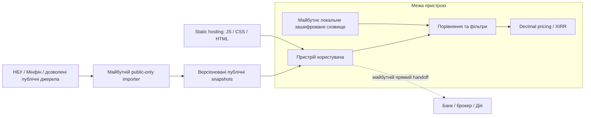
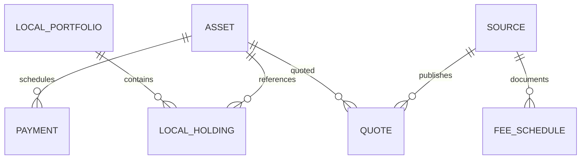

# Architecture 0.2 — public data, local calculations

Implemented: static Next.js application, direct browser-to-NBU refresh, validated committed public snapshot, local catalog filters and schedules. Separate /demo contains three synthetic quotes and local pricing. Public snapshot preparation is a CLI, not a runtime relay. Personal data storage and partner connections remain unimplemented.

## Logical data model

Public: Asset(id, isin?, currency, nominal, issueDate, maturityDate, dayCount, termsVersion); Payment(assetId, date, coupon, principal); Quote(id, assetId, sourceId, bid/ask, clean/dirty, price, accruedInterest, min/max/stepQuantity, settlementDate, observedAt, validUntil, indicative/executable); FeeSchedule(sourceId, version, effectiveFrom/To, rules, evidence); Source(id, URL, redistributionPolicy, fetchedAt).

Private future local model: LocalPortfolio(id, name, baseCurrency); LocalHolding(portfolioId, assetId, quantity, acquisitionCost); LocalSettings(id, preferences); VaultMetadata(version, cryptoParameters). No Users table or server-side portfolio FK. Partner credentials and signing keys are not ordinary portfolio records.

## Local calculation contract

`calculateBond({ quantity, cleanPrice, accruedInterest, upfrontFee, settlementDate, payments })` returns costs, net receipts, profit, cashflows, netXirr, methodology and engineVersion. Money values are decimal strings. Prices are currency units per bond, not percent of nominal. Payments are net per-unit cashflows; callers must explicitly apply applicable tax/fee policy. No generic tax engine is implemented.

`compareDemo(budget)` returns SYNTHETIC, executable=false, fixed settlement/maturity dates, assumptions and ranked results. This is a local function, not a private POST API.

## Financial invariants

- Dirty price = clean price + supplied accrued interest, once.
- Initial outflow = rounded quantity × dirty price + rounded upfront fee.
- Net XIRR uses ACT/365F and actual dates, one negative initial flow and positive/non-negative future flows.
- Invalid dates, invalid decimal strings, fractional quantities and unsupported flow shapes are rejected.
- Compare integer lots within liquidity and budget; show idle cash independently.
- All demo amounts are UAH, exemption is a scenario assumption, no recurring fees or reinvestment.

## Public feed contract

Implemented NBU snapshot: schemaVersion, source, sourcePage, retrievedAt, sourceAsOf=null, assets, excludedCount, rejected. See nbu-source.md. Quotes and fee schedules are future extensions. Nominal rates are not executable yields.

## Security boundary

No server API, cookies, account identity, analytics, document upload or signing code. Static delivery is still a supply-chain trust boundary. Production hosting headers, CSP, dependency audits and source provenance are launch gates, not claims fulfilled by this prototype.
